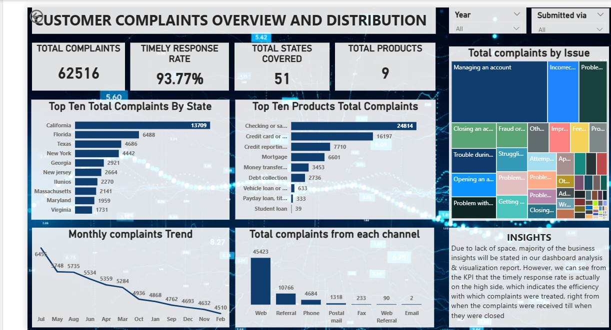
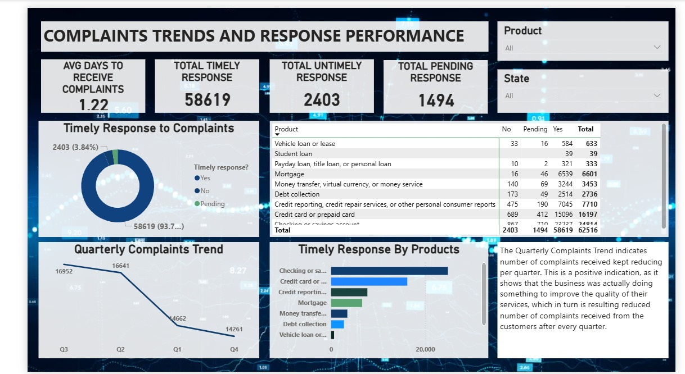

# Bank_of_America_Consumer_Complaints_Analysis

## Project Overview
This project analysis a synthetic dataset model after bank of America, covering customers complaints from **2017-2023**. It identify trends, measures response performance, and provides actionable recommendations for improving customer satisfaction.

## Business Problem
Financial institution received thousands of customers complaints. Understanding the nature of these complaints helps improve products, services, and customer experience.

## Business Questions
- Which States have the highest number of complaints?
- Which products received the most complaints?
- Which issues are reported most frequently?
- Are complaints responded to in a timely manner?
- What trends can be observed over time?

  ## Tools Used
  - Microsoft Excel (Data Cleaning)
  - Power BI (Dashboard & Visualization)
 
  ## Process
  1. Understand the business problem.
  2. Generated business questions.
  3. Cleaned the dataset in Microsoft Excel.
  4. Built an interactive dashboard in Power BI.
  5. Analyzed the results.
  6. Presented key insights and recommendations.
 
  ## Dashboard
  **The dashboard consist of 2 interactive pages**

    ### 1. Customer Complaints Overview and Distribution
  This dashboard shows
  - The states with the highest number of complaints,
  - the top 10 products that received the most complaints,
  - the issues most frequently reported,
  - the monthly complaints trend and the total complaints from each channel.
  - .

### 2. Complaints Trends and Response Performance
This dashboard shows 
- The trend of timely response to complaints,
- the quarterly complaints trend, and
- the products with the highest timely response.
- 

## Key Insights
- Califonia recorded the highest number of complaints (13,709), accounting for a significant share of all 62,516 total complaints. Florida (6,488) and Texas (4,686) followed behind.
- The Checking and Savings Account product received the highest complaints of 24,814 complaints followed by Credit cards (16,197) and Credit Reporting (7,710). These three categories accounts for the majority of customer complaints.
- The Organization achieved a 93.77% timely response rate, demostrating excellent responsiveness to customers complaints. However, the large number of complaints related to managing an account and incorrect information suggests that while issues are being addressed promptly, recurring operational problems remain.
- Although the Bank of America demostrates strong overall reponsiveness, reducing late and pending responses as this will further improve customer satisfaction.
- The downward trend suggests improvements in service quality or successful complaints prevention initiative over time.

   
## Recommendations
- The Regional and branch Managers should find out what those states with low number of complaints are doing right, what strategies are they using to minimize the number of complaints and train the members of staff of the states where most or high number of complaints are received.
- The Product Managers should review and redesign the operational process of those products that generated the highest number of complaints by simplifying the operational process further for the customers of these products. This will remove a lot of bootlenecks that made it difficult to access the products.
- The Product and Account Managers should develop a system that will focus on preventive measures and process improvement as this will have a long-term impact on reducing the causes of the complaints rather than responding quickly alone.
- The Branch Manager should carryout an investigation to know the causes of untimely responses and implement Service-Level Agreement (SLA) monitoring. Priority should also be given to resolving the back log of 1,494 pending complaints. In order to fast-track these pending complaints, adhoc staff can be employed to acheive this.
- Analyze the factors behind the quarterly decline in complaints and sustain those initiatives.

# Author
Anna Zyienom Yohanna  
Data Analyst | Excesl | Power BI | SQL| Transforming Raw Data into Meaningful Insights. - [LinkedIn](https://www.linkedin.com/in/anna-yohanna-6421b1299)

  
